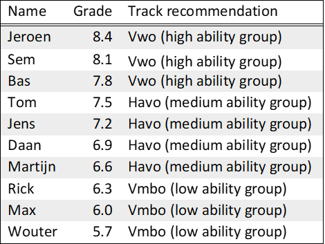

```{=html}
<style>
body {
text-align: justify}
</style>
```

```{r setup, include=FALSE}
knitr::opts_chunk$set(echo = TRUE)
```

We study whether adolescents view other differently when they are aware of what ability group (or high school track) they are assigned to. Does it affect how similar they think certain children are? Does it affect how much certain children have in common, or who has a better bond with whom? Are abilities seen as more stable and is performance attributed to internal factors rather than external factors?

To answer these research questions, we employ an between-subject experimental design. Participants see a ranked grade list of 10 hypothetical students, who are in the 6^th^ grade. These ‘students’ took a test to assess their reading, writing and math comprehension. Their grades on this test consistently decrease from 8.4 to 5.7 with a value of 0.3. In the ‘grouping condition’, participants see to what ability group (high, medium low) the students are assigned to, based on their performance:

-   High ability group: 8.4, 8.1 & 7.8;

-   Medium ability group: 7.5, 7.2, 6.9 & 6.6;

-   Low ability group: 6.3, 6.0 & 5.7.

In the ‘no-grouping condition, participants only see the names and grades of the students. Participants then answer questions about these students.

Below are two example grade lists, for each condition. Participants are assigned to the conditions at random. To control for adverse effects, the names on the grade list are matched on gender, so boys only see boy-names and girls only see girl-names. Participants who identify as non-binary are assigned at random to the boys or girls grade lists. The names on the list are Dutch and do not have particular associations with low or high socioeconomic status (SES, to control for potential biases regarding ethnicity or SES. For boys and girls each, we have two unique grade lists, to control for adverse effects regarding the names on said list. This leads to a total of 8 unique grade lists (2 Conditions x 2 Gender x 2 versions).

------------------------------------------------------------------------

## Example 1) No grouping Condition - Girls

In a minute, you will read about students in 6^th^ grade class in primary school. The students in this class took an important test last week. The test was about reading, writing and math. The teacher has graded the test. Below you can see the grades. The higher the grade, the higher that student is on the list.

<center>


<center>

------------------------------------------------------------------------

## Example 2) Grouping Condition - Boys

In a minute, you will read about students in 6^th^ grade class in primary school. The students in this class took an important test last week. The test was about reading, writing and math. The teacher has graded the test. Below you can see the grades. The higher the grade, the higher that student is on the list. Based on the grade the teacher has given a track recommendation to the students. This recommendations determines which track in high school a student will attend. Below you also see the recommendation.

***Note: in the column "Track recommendation", the information between brackets (e.g. high-medium-low ability group) is not shown to participants. As these tracks names are unique to the Dutch educational system, these labels are only to inform international readers.***

<center>



<center>
