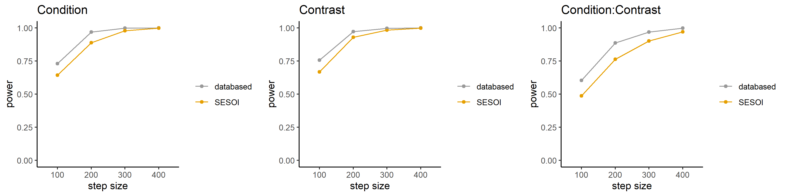

```{r setup, include=FALSE}
knitr::opts_chunk$set(echo = TRUE)
```

```{r}
rm(list = ls())
```

# Load UDF

```{r}
# This function generates a normal distribution with modifiable parameters
Sample_Mean <- function(n, 
                        mean = 0, 
                        sd = 1, 
                        min_val = -Inf, 
                        max_val = Inf, 
                        int = FALSE){
  
  x <- rnorm(n, mean, sd) # sample normal distribution with mean and sd parameters
  x <- pmin(pmax(x,min_val), max_val) # truncate values to fit mix/max parameters
  
  # ---- ROUND SAMPLE TO WHOLE NUMBERS FOR LIKERT-TYPE VARIABLES ----
  if (int == TRUE) {
    
    x <- round(x) # round draws to whole numbers to reflect
    x <- pmin(pmax(x,min_val), max_val) # Truncate again in case rounding caused range violation
  }
  return(x)
}

# This function is a confirmation for running lengthy simulations
Sim_Confirmation <- function() {
  user_input <- readline("Are you sure you want to run this? (y/n)  ")
  if(user_input != 'y') stop('Exiting since you did not press y')
  print('Good luck')
}

# This function executes the Power Analysis in Mixed power
run_sim <- function(df = "Simulated df",
                    formula = "Regression Formula",
                    fixef = "Fixed effects",
                    ranef = "Random effects",
                    SESOI = "Smallest effect size of interest", 
                    fixef_name = "(Vector of) fixed effect-names",
                    var_name = "Name of simulated variable (subjects)",
                    sub_range = "Vector with sample sizes",
                    sim_n = 1000,
                    name = "Art_Model_id."){
  
  #---- Dependencies ----
  require(mixedpower)
  require(lme4)
  
  #---- Define regression formula ----
  formula <- formula
  
  #---- Define Mixed model ----
  articifial_lmer <- makeLmer(formula, fixef = fixef,
                              VarCorr = ranef,
                              data = df)
  
  assign(paste0(name, sample(c(1:999), 1)), articifial_lmer, .GlobalEnv)
  #---- Run simulations for artificial mixed model----
  # Warning: This is the part that takes a long time.
  # Mixedpower automatically paralellizes simulations, so executing is computationally intensive
  # Mixed power default uses all available cores -1, add argument "maxCores" if wanted
  t1 <- Sys.time()
  
  power <- mixedpower(model = articifial_lmer,
                      data = df,
                      fixed_effects = fixef_name,
                      simvar = var_name, steps = sub_range,
                      critical_value = 2,
                      n_sim = sim_n,
                      SESOI = SESOI)
  
  t2 <- Sys.time()
  
  print(t2-t1)
  return(power)
}
```

# Load libraries

```{r}
# install.packages(pacman)
library(pacman)

p_load(tidyverse,
       readxl,
       lme4,
       lmerTest,
       nlme,
       simr,
       mixedpower,
       future) #Add additional packages

```

# Load data template

```{r, echo = TRUE, results = "hide"}
setwd("simulations/") # Change WD for loading files
temp <- list.files(pattern = "\\.RData") # Load all .RData files in folder 

lapply(temp, load, .GlobalEnv)

```

# Simulation-based Power Analysis

## Lmer type power analysis

### Regression formula

```{r}

formula <- Y ~ Condition*Contrast + (1 | Subject)

```

### Selection of simulated sample sizes

```{r}

sample_n <- c(100, 200, 300, 400)

```

### Effect Sizes & Variance Composition [!!klopt niet!!]

#### 1-5

##### Fixed Effects

```{r}

## ChatGPT was consulted for code & suggestions effect sizes
#---- FIXED EFFECTS (small effects) ----
fixef_15 <- c(
  "(Intercept)"        = 3.0,   # midpoint of 1–5 scale
  "Condition"          = 0.23,  # small effect
  "Contrast"           = 0.17,  # small effect
  "Condition:Contrast" = 0.14   # small interaction
)

#---- Smallest Effect Size of interest ----
# 15 percent lower than fixed effects
fixef_15_SESOI <- c(
  "(Intercept)"        = 3.0,   # midpoint of 1–5 scale
  "Condition"          = 0.20,  # small effect
  "Contrast"           = 0.15,  # small effect
  "Condition:Contrast" = 0.12   # small interaction
)

```

##### Random Effects

```{r}
#---- RANDOM EFFECTS ----
sd_subject_intercept <- 0.6      # typical for Likert 1–5

# Variance-covariance matrix for random intercept only
rand_cov_15 <- matrix(sd_subject_intercept^2, nrow=1)
rownames(rand_cov_15) <- colnames(rand_cov_15) <- "(Intercept)"

# Residual variance
sd_residual <- 0.9

# Variance list
Var_15 <- list(Subject = rand_cov_15,
               Residual = sd_residual^2)

```

#### 1-7

##### Fixed Effects

```{r}

## ChatGPT was consulted for code & suggestions effect sizes
#---- FIXED EFFECTS (small effects) ----
fixef_17 <- c(
  "(Intercept)"        = 4.0,   # midpoint of 1–7 scale
  "Condition"          = 0.29,  # small effect
  "Contrast"           = 0.23,  # small effect
  "Condition:Contrast" = 0.17   # small interaction
)

#---- Smallest Effect Size of interest ----
# 15 percent lower than fixed effects
fixef_17_SESOI <- c(
  "(Intercept)"        = 4.0,   # midpoint of 1–7 scale
  "Condition"          = 0.25,  # small effect
  "Contrast"           = 0.20,  # small effect
  "Condition:Contrast" = 0.15   # small interaction
)

```

##### Random Effects

```{r}
#---- RANDOM EFFECTS ----
sd_subject_intercept <- 1.0      # typical for Likert 1–7

# Variance-covariance matrix for random intercept only
rand_cov_17 <- matrix(sd_subject_intercept^2, nrow=1)
rownames(rand_cov_17) <- colnames(rand_cov_17) <- "(Intercept)"

# Residual variance
sd_residual <- 1.2

# Variance list
Var_17 <- list(Subject = rand_cov_17,
               Residual = sd_residual^2)

```

## Simulations - WARNING: TAKES A LONG TIME

```{r, eval=FALSE}

#---- Confirmation before starting Simulations ----
Sim_Confirmation()

Power_Likert_5 <- run_sim(df = df_PS_1,formula = formula,
                          fixef = fixef_15,
                          ranef = rand_cov_15,
                          SESOI = fixef_15_SESOI,
                          fixef_name = c("Condition", "Contrast"),
                          var_name = "Subject", 
                          sub_range = sample_n,
                          sim_n = 1400)

save(Power_Likert_5, file = paste0("Power/Likert_5_", format(Sys.time(), "%Y%m%d-%H%M%S")))

Power_Likert_7 <- run_sim(df = df_A_1,formula = formula,
                          fixef = fixef_17,
                          ranef = rand_cov_17, 
                          SESOI = fixef_17_SESOI,
                          fixef_name = c("Condition", "Contrast"),
                          var_name = "Subject", 
                          sub_range = sample_n,
                          sim_n = 1400)

save(Power_Likert_7, file = paste0("Power/Likert_7_", format(Sys.time(), "%Y%m%d-%H%M%S")))

```

```{r, echo=FALSE}

load("Power/Likert_5_20251201-152710")
load("Power/Likert_7_20251201-154345")

```

# Likert 5

Model description

```{r}

multiplotPower(Power_Likert_5, filename = "Power/powerplot_likert_5.png")

```



# Likert 7

```{r}
multiplotPower(Power_Likert_7, filename = "Power/powerplot_likert_7.png")


```


